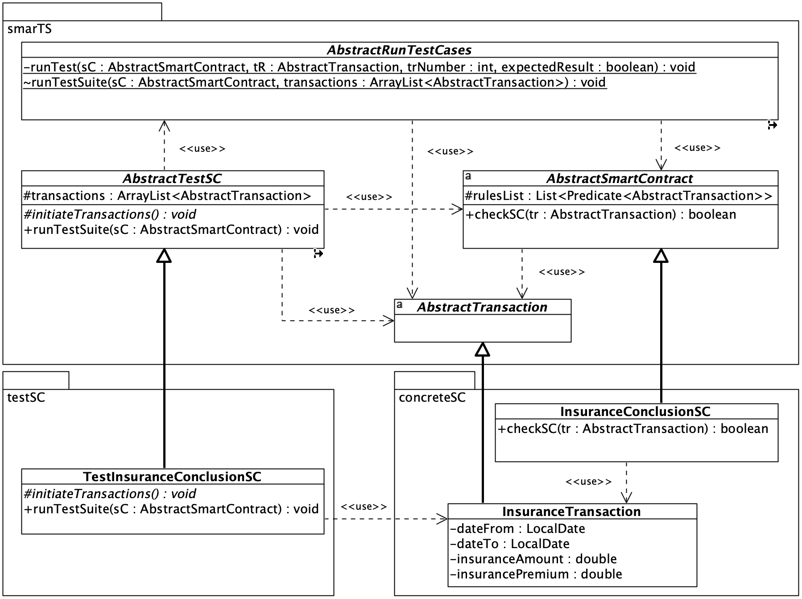

# SmarTS
The package generates and runs a minimal set of test cases for the smart contract.

## The package structure

The package structure includes an abstraction layer that is a reusable component, which can be directly used in smart contract development projects.

The abstract layer of the SmarTS package consists of four classes:
* ``AbstractTransaction`` class --- The abstract class that represents the generic transaction.
* ``AbstractSmartContract`` class --- The abstract class that defines the generic smart contract. The class declares a data structure for storing smart contract verification rules. The single verification rule is declared as a ``Predicate<AbstractTransaction>`` type. The implementation of the transaction verification mechanism was provided in the ``checkSC()`` method. The method was marked as final which prevents overriding.
* ``AbstractTestSC`` class --- This is the only public class in the package. The class exposes one method as public, runTestSuite(). The method is implemented in the abstract class and marked with the optional final modifier, which blocks the ability to override ``runTestSuite()`` method in actual test classes. In such a manner, a uniform mechanism of operation of the method was enforced for all real test classes of smart contracts. On the other hand, the ``initiateTransactions()`` method is abstract and must be implemented by a specific smart contract test class. The method should create transaction objects needed to execute a test suite for the smart contract.
* ``AbstractRunTestCases`` class --- the package-private access modifier applied to that class limits its visibility and accessibility only within the package. The abstract class itself exposes only ``runTestSuite()``. However, limits the visibility of the method, by applying a protected access modifier, only to classes in the same package or child classes. The private method ``runTest()`` is responsible for executing a single test case.

## Package classes in a UML class diagram

The figure below presents the UML Class diagram with abstract classes in the SmarTS package, as well as example concrete smart contract and test classes.

  

## Running test suites

The ``RunTestSuite`` class should be run to execute predefined test suites for two example smart contracts. 
